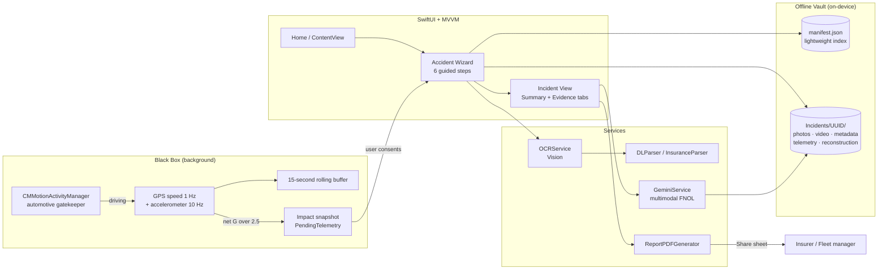

# Accident Assistant

**A calm, guided co-pilot for the first 15 minutes after a car accident.**

Accident Assistant is a native iOS app that turns a panicked, error-prone moment into a structured evidence package. It walks a shaken driver through safety and documentation step by step, quietly captures the vehicle's speed history leading up to the impact, and packages everything — photos, video, the other driver's details, telemetry, and an AI-drafted incident reconstruction — into a shareable First Notice of Loss (FNOL) PDF for insurers and fleet managers.


---

## Table of Contents

1. [Product Overview](#product-overview)
2. [Key Features & Capabilities](#key-features--capabilities)
3. [Tech Stack & Architecture](#tech-stack--architecture)
4. [Getting Started (Developer Setup)](#getting-started-developer-setup)
5. [Testing Crash Detection: the "Couch Test"](#testing-crash-detection-the-couch-test)
6. [What Data Is Sent to the AI](#what-data-is-sent-to-the-ai)
7. [Roadmap](#roadmap)
8. [Known Limitations](#known-limitations)

---

## Product Overview

### The problem

Right after a collision, drivers are in shock and run on adrenaline. They are also the only people who can collect the evidence that decides the claim. They forget to photograph the scene before cars are moved, they copy down the wrong policy number, and they cannot say how fast they were going. Insurers and fleet managers then get a thin, inconsistent report that takes days of back-and-forth to complete.

### The solution

Accident Assistant replaces a blank form with a **guided, one-decision-per-screen workflow** built for someone who can't think clearly:

| Driver need | How the app responds |
|---|---|
| *"I don't know what to do first."* | A 6-step wizard that puts safety first: injuries, location, securing the scene, when to call police, photos, and the other driver's details. 911 is always one tap away. |
| *"I can't remember what happened."* | A background telemetry "black box" that keeps the **last 15 seconds of GPS speed** and freezes them the moment it senses an impact. |
| *"I'm on a rural road with no signal."* | **Offline-first.** Every photo, field, and telemetry snapshot is written to the device immediately. Unfinished reports are saved as resumable **drafts**. |
| *"I can't type right now."* | The camera scans the other driver's **license barcode** and **insurance card** and fills in the fields for them. |
| *"What do I send my insurer?"* | An **AI-drafted, fact-only FNOL reconstruction** exported as a professional PDF, ready to share by Mail, Messages, or AirDrop. |

### Who it's for

- **Individual drivers** who want a complete, credible claim on the first submission.
- **Fleet operators and adjusters** who need consistent, structured incident intake across many drivers.

### Product principles

1. **Safety before evidence.** The flow never asks for a photo before asking whether anyone is hurt.
2. **Never lose data.** Every capture is saved to disk as it happens, and files are written atomically.
3. **Only capture when it matters.** High-power sensors run only when the phone detects the user is driving.
4. **Facts, not fault.** The AI is told to report only what the evidence proves, to write "Unknown" instead of guessing, and never to assign liability.

---

## Key Features & Capabilities

### Smart telemetry gatekeeper ("Black Box")

- **Low-power gatekeeper.** `CMMotionActivityManager` watches for *automotive* motion. GPS and the accelerometer run only while the user is driving and shut off when they are walking or stationary, which keeps battery drain low the rest of the time.
- **Rolling 15-second pre-impact buffer.** Once driving is detected, the app samples GPS speed once per second into a fixed-size ring buffer (`T-14s … T-00s`), so memory use stays constant however long the trip is.
- **10 Hz crash sentinel.** Each accelerometer sample is converted to net G-force with gravity removed. Any spike above **2.5 G** freezes the buffer, marks the final second as `IMPACT`, and stores it as *pending telemetry*.
- **User-consented attachment.** The next time the driver taps *Start New Report*, the app shows the impact time and asks whether to attach the data. It is never attached silently.
- **Force-quit safeguard.** If the app is terminated, it schedules a local notification asking the driver to re-arm crash detection.

### Offline-first draft persistence

- **Local "vault" on the device.** Each incident gets its own folder (`Documents/Incidents/{UUID}/`) containing photos, dashcam video, `metadata.json`, `telemetry.json`, and the AI reconstruction.
- **Two-tier index.** A lightweight `manifest.json` powers the home-screen list without opening individual incident folders. Heavier detail records load only when that incident is opened.
- **Atomic writes everywhere.** Manifest, metadata, and media writes use `.atomic` options, so a crash or dead battery mid-write never corrupts the index.
- **Resumable drafts.** A report starts as a `draft` when the wizard begins and becomes `active` only when the driver completes it. Drafts show a **DRAFT** badge and reopen the wizard exactly where the driver left off.
- **Protective discard logic.** Cancelling deletes a draft *only* if it is completely empty: no photos, no location, and no attached telemetry. Anything the driver captured is kept.
- **Collision-safe file naming.** Media is never silently overwritten; duplicate names get numeric suffixes.

### Guided accident wizard

- 6 steps: **Safety → Location → Secure the Scene → Authorities → Document Scene → Other Driver's Information**, with one primary action per screen.
- Tap-to-call **911** from the safety and police steps.
- **Location** detected by GPS with reverse geocoding, plus MapKit address autocomplete for manual correction.
- Photos from the **live camera** or the **Photos library** (up to 10 at a time).

### On-device document intelligence

- **Driver's license:** Apple Vision's PDF417 barcode detector plus a custom **AAMVA parser** extract name, license number, date of birth, and issue and expiration dates.
- **Insurance card:** Vision text recognition plus a rule-based **InsuranceParser** (carrier keyword matching and policy-number regex).
- All OCR runs **on the device**. No document images are uploaded for scanning.

### Evidence room and AI reconstruction

- A two-tab incident view. **Summary** is the paperwork view. **Evidence** is a media gallery with multi-select, rename, delete, full-screen preview, and an editable Other Driver card.
- **Dashcam and scene video:** record in the app or import from the library. Imported files keep their original names and capture dates.
- **AI photo auto-naming:** camera captures are saved right away under a timestamp name. A background task then sends that photo to Gemini for a short descriptive label and renames the file, so the UI never waits on the network.
- **Multimodal FNOL reconstruction** with Google Gemini, built from the incident's photos, videos, and telemetry snapshot (see [What Data Is Sent to the AI](#what-data-is-sent-to-the-ai)). It returns strict JSON with a summary, a pre-impact/impact/post-impact timeline, visual damage, environmental factors, and liability *indicators*. The driver chooses **Standard (Fast)** or **Forensic (Deep)** mode.
- **Cost guard:** the app refuses to call the model when there is no evidence to analyse.
- **Resilient networking:** exponential backoff on HTTP 429 and 503, typed errors, and longer timeouts for requests that include video.

### Export and sharing

- **One-tap PDF export.** A print-ready SwiftUI template is rendered to a single-page, letter-width PDF with `ImageRenderer` and Core Graphics.
- **Share sheet** pre-fills an email subject line when the driver shares by Mail.
- **Driver profile** (name, fleet ID, insurer) stored locally to identify the reporting driver.

### Developer "Couch Test" mode (`#if DEBUG`)

- Debug builds show a **"Force Start Couch Test"** button on the home screen. It skips the automotive gatekeeper and starts the full sensor pipeline, so crash detection can be tested at a desk or on a couch without driving.
- The button is removed by the compiler in **Release** builds, so none of this test code ships in production.
- Simulator fallbacks (`#if targetEnvironment(simulator)`) stand in for the camera and the barcode scanner, so the whole wizard can be clicked through without hardware.

---

## Tech Stack & Architecture

### Tech stack

| Layer | Technology |
|---|---|
| Language | **Swift 6** toolchain; the codebase compiles cleanly, with no errors or warnings, in Swift 6 language mode with strict concurrency |
| Concurrency | `async/await`, `@MainActor` default isolation (`SWIFT_DEFAULT_ACTOR_ISOLATION = MainActor`), `nonisolated` delegate callbacks, `Task.detached` for background AI work, `Sendable` models |
| UI | **SwiftUI** (`NavigationStack`, `TabView`, `PhotosPicker`, `ImageRenderer`), with UIKit bridges for the camera and share sheet |
| Architecture | **MVVM**: SwiftUI views, `ObservableObject` view models and stores, and stateless service and parser layers |
| Sensors & telemetry | **Core Motion** (`CMMotionActivityManager`, `CMMotionManager`), **Core Location** (background location updates) |
| Maps & places | **MapKit** (`MKLocalSearch`, `MKLocalSearchCompleter`) |
| On-device ML | **Vision** (`VNRecognizeTextRequest`, `VNDetectBarcodesRequest` for PDF417) |
| Media | **AVFoundation** (video metadata), **PhotosUI**, `UIImagePickerController` |
| Persistence | `FileManager` + `Codable` JSON with atomic writes (no database dependency) |
| Documents | **Core Graphics** PDF context + SwiftUI `ImageRenderer` |
| Notifications | **UserNotifications** (force-quit re-arm prompt) |
| Generative AI | **Google Gemini** REST API (`gemini-2.5-flash`, `gemini-3.0-pro`), multimodal inline data |
| Dependencies | **None.** Apple frameworks only; no CocoaPods and no Swift packages |

### Architecture overview



### Data flow: from impact to FNOL

1. **Detect.** `TelemetryManager` sees automotive motion and turns on GPS and the accelerometer. An impact over 2.5 G freezes the 15-second buffer into `AccidentStore.pendingTelemetry`.
2. **Consent.** The driver taps *Start New Report*, sees the impact time, and chooses whether to attach the data. A `draft` incident folder is created and `telemetry.json` is written into it.
3. **Capture.** The wizard saves each photo, location, and scanned document field to disk as it is collected. If the app is closed or the phone dies, the draft is still there.
4. **Finalize.** Finishing the wizard changes the status from `draft` to `active` in `manifest.json`.
5. **Reconstruct.** In the Summary tab, `GeminiService` sends the incident's telemetry, photos, and videos to Gemini and receives a JSON reconstruction, which is saved as `reconstruction.txt`.
6. **Deliver.** `ReportPDFGenerator` renders the FNOL PDF, and the share sheet sends it to the insurer or fleet manager.

### Project structure

```
accident-assistant-ios/
├── README.md
├── AccidentAssistant.xcodeproj
└── AccidentAssistant/
    ├── AccidentAssistantApp.swift        # App entry point
    ├── ContentView.swift                 # Home: reports list, Couch Test (DEBUG), impact alert
    ├── AccidentWizardView.swift          # 6-step guided capture flow + draft resume/discard
    ├── IncidentReportView.swift          # Summary / Evidence tab container
    ├── IncidentSummaryTabView.swift      # AI reconstruction, model picker, PDF export & share
    ├── IncidentEvidenceTabView.swift     # Media gallery, video, editable driver/insurance card
    ├── FNOLSummaryView.swift · PDFTemplateView.swift · UserProfileView.swift
    ├── OCRScannerView.swift · VideoRecorderView.swift
    ├── EvidenceGalleryViewModel.swift    # Home-screen view model
    ├── TelemetryManager.swift            # Gatekeeper, rolling buffer, crash sentinel
    ├── AccidentStore.swift               # Offline vault: manifest, incidents, media, telemetry
    ├── IdentityStore.swift               # Local driver profile
    ├── LocationManager.swift             # GPS + reverse geocoding + address autocomplete
    ├── OCRService.swift                  # Vision text + PDF417 barcode detection
    ├── DLParser.swift · InsuranceParser.swift
    ├── GeminiService.swift               # Multimodal LLM client with retry/backoff
    ├── PhotoAutoNamer.swift · LibraryMediaNamer.swift
    ├── ReportPDFGenerator.swift
    ├── IncidentReport.swift              # Shared value types
    ├── Info.plist                        # Background location mode, API key injection
    └── Secrets.xcconfig                  # ⚠️ Git-ignored — you create this (see setup)
```

---

## Getting Started (Developer Setup)

### 1. Prerequisites

| Requirement | Version |
|---|---|
| Mac with Xcode | **Xcode 26 or later** (verified with Xcode 27.0) |
| iOS target | **iOS 26.0+** (simulator or physical iPhone) |
| Apple ID | A free Apple ID is enough to run the app on your own iPhone |
| Gemini API key | *Optional.* Only needed for AI reconstruction and photo auto-naming. Get a free key at [Google AI Studio](https://aistudio.google.com/app/apikey) |

> **Physical device strongly recommended.** The simulator has no accelerometer and no motion-activity sensor, so crash detection and the Couch Test only work on a real iPhone. Everything else, including the full wizard, can be tried in the simulator.

### 2. Clone the repository

```bash
git clone https://github.com/xmeng0/accident-assistant-ios.git
cd accident-assistant-ios
```

### 3. Create `Secrets.xcconfig` (required, including without an API key)

The Xcode project reads its build settings from `AccidentAssistant/Secrets.xcconfig`. The file is **git-ignored** so API keys never reach GitHub. **Without it the build fails** with `Unable to open base configuration reference file`.

Create it from the repository root:

```bash
cat > AccidentAssistant/Secrets.xcconfig <<'EOF'
// Local secrets. Never commit this file.
GEMINI_API_KEY = paste-your-key-here
EOF
```

- **No key yet?** Leave the value empty (`GEMINI_API_KEY =`). The app builds and runs normally. Only the AI features will show a *"GEMINI_API_KEY is missing"* message.
- How the key reaches the app: `Secrets.xcconfig` → `$(GEMINI_API_KEY)` in `Info.plist` → read at runtime with `Bundle.main.infoDictionary`.

### 4. Open the project and resolve dependencies

```bash
open AccidentAssistant.xcodeproj
```

The project uses **no third-party packages**, so there is nothing to download. If Xcode still shows a package-related error, for example from a stale cache:

1. **File → Packages → Reset Package Caches**
2. **File → Packages → Resolve Package Versions**
3. **Product → Clean Build Folder** (⇧⌘K)

### 5. Choose the build configuration (Debug vs. Release)

The shared **AccidentAssistant** scheme runs the **Debug** configuration by default.

| Configuration | Use it for | Couch Test button | Simulator mocks |
|---|---|---|---|
| **Debug** (default) | Development, demos, sensor testing | ✅ Visible | ✅ When on the simulator |
| **Release** | Production-like behaviour and performance | ❌ Compiled out | ✅ When on the simulator |

To switch: **Product → Scheme → Edit Scheme… (⌘<)** → **Run** → **Info** tab → **Build Configuration** → pick *Debug* or *Release* → **Close**.

To check that the project compiles, you can also build from the command line without signing:

```bash
xcodebuild -project AccidentAssistant.xcodeproj -scheme AccidentAssistant -configuration Debug -destination 'generic/platform=iOS Simulator' CODE_SIGNING_ALLOWED=NO build
```

### 6a. Run on the Simulator

1. In the Xcode toolbar, choose an **iPhone simulator running iOS 26 or later** as the run destination.
2. Press **Run** (⌘R). The simulator does not need code signing.

### 6b. Run on a physical iPhone (Apple ID code signing)

The project file contains the original author's team ID and bundle ID, and **you must replace both** with your own:

1. **Add your Apple ID to Xcode:** **Xcode → Settings… → Accounts** → **+** → **Apple ID** → sign in.
2. In the Project Navigator, select the **AccidentAssistant** project → **AccidentAssistant** target → **Signing & Capabilities** tab.
3. Leave **Automatically manage signing** ✅ checked.
4. Set **Team** to your own team. With a free Apple ID this appears as *"Your Name (Personal Team)"*.
5. Change **Bundle Identifier** from `com.AA.AccidentAssistant` to something unique, e.g. `com.yourname.AccidentAssistant`. Apple requires bundle IDs to be unique across all developers, so keeping the original causes a *"Failed to register bundle identifier"* error.
6. Connect your iPhone with USB (or pair it over Wi-Fi), unlock it, and tap **Trust This Computer**.
7. **Enable Developer Mode on the iPhone:** **Settings → Privacy & Security → Developer Mode** → on → restart when asked.
8. Select your iPhone as the run destination and press **Run** (⌘R).
9. **First launch with a free Apple ID only:** if iOS says *"Untrusted Developer"*, open **Settings → General → VPN & Device Management**, tap your Apple ID under *Developer App*, and choose **Trust**.
10. When the app asks, grant **Camera**, **Microphone**, **Location (choose "Always" for background crash detection)**, and **Motion & Fitness**.

> **Free-account note:** apps signed with a Personal Team expire after **7 days**. Press **Run** in Xcode again to reinstall. A paid Apple Developer Program membership removes this limit.

### Troubleshooting

| Symptom | Fix |
|---|---|
| `Unable to open base configuration reference file … Secrets.xcconfig` | You skipped [step 3](#3-create-secretsxcconfig-required-including-without-an-api-key). Create the file. |
| `Signing for "AccidentAssistant" requires a development team` | Choose your Team in **Signing & Capabilities** ([step 6b](#6b-run-on-a-physical-iphone-apple-id-code-signing)). |
| `Failed to register bundle identifier` | Change the Bundle Identifier to one only you use. |
| No run destination matches / iOS version too old | Update the device or simulator to iOS 26+ and Xcode to 26+. |
| "GEMINI_API_KEY is missing" in the app | Add a key to `Secrets.xcconfig`, then **Clean Build Folder** (⇧⌘K) and run again. |
| Couch Test does nothing in the simulator | Expected. The simulator has no accelerometer, so use a physical iPhone. |

---

## Testing Crash Detection: the "Couch Test"

Available in **Debug** builds on a **physical iPhone**:

1. Launch the app and tap the orange **Force Start Couch Test** button. It turns blue and reads **Stop Black Box**.
2. Wait **at least 15 seconds** so the rolling buffer fills.
3. Simulate an impact with a sharp jolt, such as a firm drop onto a couch cushion. The phone must register more than 2.5 G net of gravity.
4. The Xcode console prints `🚨 IMPACT DETECTED — Pre-impact buffer:` followed by the JSON snapshot.
5. Tap **Start New Report**. The **Impact Detected** alert shows the impact time. Choose **Yes, attach** to add the telemetry to a new draft.
6. Tap **Stop Black Box** to end the session.

---

## What Data Is Sent to the AI

The app calls Google's Gemini API in exactly two situations. Everything else, including document scanning, runs on the device.

### 1. AI reconstruction (when the driver taps *Generate AI Reconstruction*)

| Sent to Gemini | Details |
|---|---|
| **Scene photos** | Every photo saved in the incident, from the camera or the library. Each is downscaled to a maximum of 1600 px and re-encoded as JPEG. |
| **Videos** | Every dashcam or scene video saved in the incident, sent in full. |
| **Telemetry snapshot** | The pre-impact buffer, if one was attached: up to 15 one-second entries, each with a time offset (`T-14s … T-00s`), speed in mph, and an event label (`normal` or `IMPACT`). |
| **Instructions** | A fixed prompt telling the model to state only what the evidence shows, to write "Unknown" otherwise, and not to assign fault. |

The reconstruction is generated **only from those inputs**: what is visible in the photos and videos, plus the speed timeline.

**Not sent, although the app stores them:**

- The driver's written description of the incident
- The incident location and the crash date and time
- The other driver's name, licence number, date of birth, insurer, and policy number
- The licence and insurance-card images used for scanning (these are never saved as evidence)
- The reporting driver's own profile (name, fleet ID, insurer)

The request has fields for location, crash time, and the driver's description, but the app currently fills them with "Unknown" / "Not provided". Passing the real values is on the roadmap. Raw G-force readings are not recorded; an impact appears only as the `IMPACT` label on the final entry.

If the incident has no photos, no videos, and no telemetry, the app does not call the API at all.

### 2. Photo auto-naming (automatic, on each camera capture)

When the driver takes a photo **with the in-app camera**, that single photo (downscaled as above) is sent to Gemini in the background with a short prompt asking for a descriptive file name. This happens without a separate confirmation. Photos imported from the library are not sent for naming.

### What comes back and where it goes

- The reconstruction is returned as JSON (summary, timeline, visual damage, environmental factors, liability indicators) and saved on the device as `reconstruction.txt` in the incident folder.
- Photo labels are used only to rename the file on the device.
- The app has no backend of its own. Requests go directly from the phone to Google, authenticated with the API key bundled in the app.

---

## Roadmap

Development was run in themed sprints, each aimed at one user outcome.

| Sprint | Theme | Outcome | Status |
|---|---|---|---|
| 1 | **The Life-Raft** | Guided wizard, camera capture, and a crash-safe local vault with an atomic manifest | ✅ Shipped |
| 2 | **The Digital Clerk** | Evidence gallery, driver profile, on-device OCR for license and insurance cards, FNOL auto-fill | ✅ Shipped |
| 3 | **The Black Box** | GPS and motion telemetry, dashcam video intake from the library or camera | ✅ Shipped |
| 4 | **The Narrator** | Deterministic speed/G-force timeline, dual-path media intake, OCR moved off the UI path | ✅ Shipped |
| 5 | **The Adjuster** | Multimodal AI reconstruction, PDF export, share flow | ✅ Core shipped · 🔄 Hardening |

**Next up**

- **Richer AI context:** pass the driver's description, location, and crash time into the reconstruction request, and record peak G-force in the telemetry.
- **Consent and PII safeguards:** ask before any photo is sent to the model (including auto-naming), and blur faces and number plates.
- **Server-side AI proxy:** move the Gemini key out of the app bundle and add authentication and rate limiting.
- **Large-video pipeline:** upload files with resumable transfers instead of inline base64, and extract keyframes.
- **Direct submission:** secure links or integrations for fleet-management and claims systems.
- **Crash-detection tuning:** add gyroscope fusion and speed-drop checks to reduce false positives from dropped phones.

---

## Known Limitations

This is a working prototype built as a portfolio piece. These trade-offs were made deliberately and are listed openly:

- **API key on the client.** The Gemini key is bundled with the app for prototyping. A production release would send requests through a backend.
- **Evidence leaves the device for AI features.** Photos, videos, and telemetry are sent to Google's Gemini API when the driver taps *Generate*, and each in-app camera photo is sent for auto-naming as it is taken. Photos can show faces and number plates, and there is no consent screen yet. OCR does not upload anything.
- **The AI reconstruction does not yet use the driver's description, location, or crash time.** See [What Data Is Sent to the AI](#what-data-is-sent-to-the-ai).
- **Crash threshold is a single heuristic** (2.5 G net), tuned for demos rather than validated against real crash data.
- **Crash detection runs while the app is running or in the background**, not after the user force-quits it. The re-arm notification reduces this gap but cannot remove it.
- **Not a substitute for emergency services or legal advice.** The AI output is a draft for the driver to review before sending.

---

*Built by Sean Meng.*
